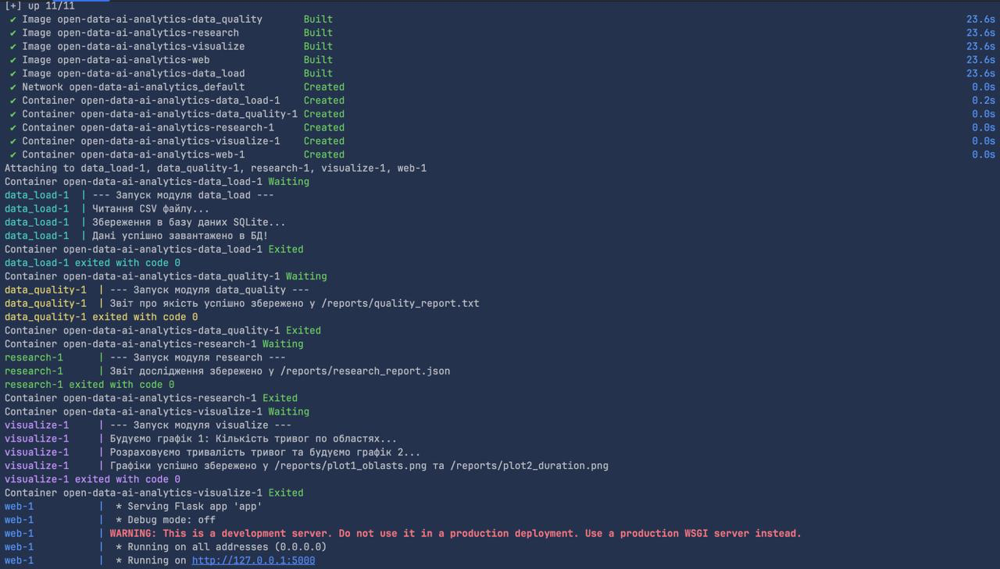
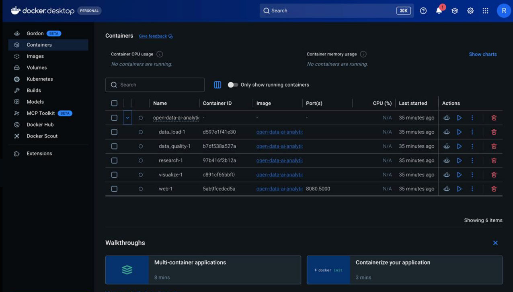

У ході виконання роботи було створено локальний Git-репозиторій open-data-ai-analytics. 
Налаштовано структуру папок для проєкту та файл .gitignore.
Було відпрацьовано створення feature-гілок, їх злиття у гілку main (у тому числі з використанням прапорця --no-ff). 
Штучно створено та успішно розв'язано merge-конфлікт у файлі README.md. 
Проєкту присвоєно початковий тег v0.1.0.

* f861e56 (HEAD -> main, tag: v0.1.0) docs: add CHANGELOG for v0.1.0
* 5e023b4 (feature/visualization) feat: add visual data analysis script
* 12ae15e fix: resolve merge conflict in README.md
|\  
| * 13a6761 (conflict-b) docs: update README from branch B
* | cc66f1c (conflict-a) docs: update README from branch A
|/  
* e28c03d Merge: додано код для аналізу даних та побудови базових моделей
|\  
| * b4c7bcd (feature/data_research) feat: add research logic and modeling
|/  
* b822850 Merge: додано скрипт для перевірки якості даних на пропуски та дублікати
|\  
| * 427ac58 (feature/data_quality_analysis) feat: add data quality checks
|/  
* cf80cce (feature/data_load) feat: add script to load data
* b8bc01f docs: add project description and hypotheses
* 5731b8d chore: add project structure and .gitignore

# Звіт з лабораторної роботи №2 (DevOps)
**Тема:** Побудова CI/CD конвеєрів за допомогою GitHub Actions
**Виконав:** Семенов Олександр Володимирович, Національний університет «Львівська політехніка»

## Частина A — CI для кожного модуля
1. У директорії `.github/workflows/` створено файл конфігурації `ci.yml`.
2. **Тригери запуску:** - Автоматично при `push` та `pull_request` у гілку `main`.
   - Вручну через `workflow_dispatch` з можливістю вибору конкретного модуля (`load_data`, `data_quality`, `research`, `visualize`) або запуск усіх одразу.
3. **Паралелізм:** Використано стратегію `matrix`, що дозволяє запускати всі модулі проєкту одночасно на різних віртуальних машинах GitHub (ubuntu-latest).
4. **Кроки виконання:** Встановлення Python 3.12, запуск скриптів та логування виводу у файли.

## Частина B — CD/Публікація результатів
1. Налаштовано автоматичне завантаження результатів роботи (логів виконання) як **GitHub Actions Artifacts**.
2. Після кожного успішного прогону в розділі "Summary" доступні для завантаження 4 архіви (по одному на кожен модуль), що містять звіти про виконання.

## Частина C — Self-hosted runner (локальний агент)
1. На власному ПК підключено та активовано локальний агент (Self-hosted runner).
2. Створено workflow `ci-selfhosted.yml`, який використовує тег `runs-on: self-hosted` для виконання модуля візуалізації локально.

### Порівняння ранерів:

| Критерій | GitHub-hosted (Cloud) | Self-hosted (Local Mac) |
| :--- | :--- | :--- |
| **Швидкість** | Витрачається час на ініціалізацію ВМ (Spin-up). | Майже миттєвий запуск, оскільки середовище вже готове. |
| **Доступ до ресурсів** | Обмежений ізольованою ВМ. | Прямий доступ до локального диска та великих датасетів без копіювання. |
| **Ризики** | Обмеження безкоштовних хвилин. | Потреба в самостійній підтримці стабільності та ризики безпеки локальної системи. |

## Посилання на репозиторій з виконаним CI:
[https://github.com/RaDvyD/open-data-ai-analytics](https://github.com/RaDvyD/open-data-ai-analytics)

# Короткий звіт з лабораторної роботи №3 (Docker)
**Виконав:** Семенов Олександр Володимирович

**1. Які сервіси створені:**
Проєкт успішно розділено на 5 незалежних мікросервісів. Кожен сервіс має власний `Dockerfile` і базується на легкому образі `python:3.12-slim`. Створено сервіси: підготовки даних (`data_load`), перевірки якості (`data_quality`), дослідження (`research`), візуалізації (`visualize`) та веб-інтерфейс (`web`).

**2. Як організовано взаємодію:**
Взаємодія між ізольованими контейнерами реалізована двома шляхами:
* **Через базу даних:** Використано просту СУБД SQLite. Файл бази лежить у спільній папці, що дозволяє модулям аналізу читати дані, завантажені першим сервісом.
* **Через Docker Volumes (спільні томи):** Створено спільні томи `./db:/db` та `./reports:/reports`. Завдяки цьому графіки та звіти, згенеровані аналітичними сервісами, миттєво стають доступними для веб-сервера.
* Також налаштовано строгу послідовність запуску через `depends_on: condition: service_completed_successfully`, щоб уникнути ситуації, коли аналіз починається до створення бази.
  
* На Рисунку X наведено повний консольний вивід запуску проєкту за допомогою Docker Compose. Процес розпочався зі збирання образів (Built) та створення віртуальної мережі. Далі зафіксовано послідовне виконання мікросервісів: модуль data_load завантажив дані в SQLite, data_quality згенерував звіт про якість даних, research зберіг результати у форматі JSON, а visualize успішно побудував графіки тривог по областях та їх тривалості. Усі аналітичні контейнери завершили роботу з кодом 0 (exited with code 0), після чого запустився Flask-сервер (контейнер web-1), який почав прослуховувати порт 5000 для доступу до веб-інтерфейсу.
* 
* На Рисунку X представлено графічний інтерфейс Docker Desktop, який демонструє структуру розгорнутого багатоконтейнерного застосунку open-data-ai-analytics. У середовищі успішно створено та згруповано 5 ізольованих мікросервісів, що відповідають за різні етапи аналітичного пайплайну: data_load-1, data_quality-1, research-1, visualize-1 та web-1. Інтерфейс також підтверджує коректне налаштування мережі — для веб-сервера (web-1) застосовано прокидання портів (port mapping) з внутрішнього порту 5000 на зовнішній. Таке візуальне представлення доводить правильність написання конфігураційного файлу compose.yaml та успішну ізоляцію кожного аналітичного модуля
**3. Які труднощі виникли та як їх вирішено:**
* *Труднощі з синхронізацією:* Спочатку контейнери намагалися запуститися одночасно, через що модуль аналізу не міг знайти базу даних, яку ще не встиг створити модуль завантаження. Проблема вирішена налаштуванням залежностей у `compose.yaml`.
* *Зайнятість портів:* Під час запуску веб-сервера виник конфлікт портів. Проблему вирішено шляхом прокидання іншого вільного порту (наприклад, 8000:5000) на хост-машину.

4 ЧАСТИНА
Розгортання інфраструктури (Infrastructure as Code)

Для автоматизованого розгортання хмарного середовища в AWS було створено директорію terraform, яка містить модульну конфігурацію. У ході роботи було розроблено та налаштовано наступні файли:

main.tf: Головний конфігураційний файл Terraform. У ньому визначено провайдера (AWS) та описано всі необхідні хмарні ресурси: створення віртуальної машини (EC2 інстансу) та налаштування груп безпеки (Security Groups) для дозволу вхідного трафіку на необхідні порти (наприклад, порт 8000 для доступу до веб-додатку).

variables.tf: Файл для оголошення вхідних змінних. Винесення параметрів (таких як регіон розгортання, тип інстансу тощо) у змінні робить архітектуру гнучкою та дозволяє легко змінювати конфігурацію без редагування основного коду.

outputs.tf: Файл, що визначає вихідні значення після успішного виконання команди terraform apply. Завдяки йому в консоль автоматично виводиться згенерована публічна IP-адреса сервера та готове URL-посилання для доступу до розгорнутої системи.

cloud-init.yaml: Скрипт первинної ініціалізації сервера (User Data). Цей файл автоматизує налаштування ОС відразу після старту віртуальної машини: він відповідає за встановлення необхідних залежностей (Docker, Docker Compose), завантаження коду з репозиторію та автоматичний запуск контейнерів.